# FLOWSA User-Guide

# User-Guide Contents
- [FLOWSA Objective](#flowsa-objective)
  - [_Sector_ Definition](#_sector_-definition)
  - [FLOWSA Data Outputs](#flowsa-data-outputs)
- [FLOWSA Organization and Big Picture](#flowsa-organization-and-big-picture)
  - [Naming Schemas](#naming-schemas)
  - [USEPA Tools for Industrial Ecology](#usepa-tools-for-industrial-ecology)
- [Generating Flow-By-Activity Datasets](#generating-flow-by-activity-fba-datasets)
  - [Overview of Steps to Generate a Flow-By-Activity Dataset](#overview-of-steps-to-generate-a-flow-by-activity-dataset)
  - [Detailed Steps to Writing an FBA method YAML](#detailed-steps-to-writing-an-fba-method-yaml)
- [Creating an activity-to-sector mapping file](#mapping-fba-data-to-sectors-via-activity-to-sector-crosswalks)
  - [Re-Generating Master Sector Crosswalks](#re-running-sector-master-crosswalks)
- [Generating Flow-By-Sector Datasets](Generating Flow-By-Sector Datasets)
- [Accessing FLOWSA-Generated Data and Data Storage](#accessing-flowsa-generated-data-and-data-storage)
- [Data Visualization](#data-visualization)
- [FLOWSA Git/GitHub Management](#flowsa-gitgithub-management)
  - [Branches](#branches)
  - [New Release Workflow](#new-release-workflow)
  - [GitHub Actions](#github-actions)

# FLOWSA Objective
FLOWSA is a Python package designed to streamline attributing environmental, economic, emission, waste, material, and other data to industry and end-use sectors. 
FLOWSA pulls data from primary environmental and economic sources (generally government or other publicly available sources), that use a variety of terminology and units, and attributes those data to standardized classification and units. 
Data can be attributed to sectors that produce the data and/or sectors that consume the data. 
This way, a single row in a dataset captures the generation of, the consumption of, or the direct flow of environmental/economic data between two sectors. 
For example, we can capture water withdrawals consumed by wheat farming (Sector-Consumed-By) or the movement of water from public supply withdrawals (Sector-Produced-By) to domestic use (Sector-Consumed-By). 


## _Sector_ Definition
_Sectors_ are standardized codes that classify industries and final end-users.
To date, sectors are primarily 2-6 digit North American Industry Classification System ([NAICS](https://www.census.gov/naics/)) codes. 
As some primary sources contain data that are more detailed than the official 6-digit NAICS, we extended the official NAICS, creating unofficial 7-digit sector codes. 
These 7-digit codes can be aggregated to official NAICS codes. 
An example of 7-digit sectors can be found in the [crosswalk](https://github.com/USEPA/flowsa/blob/master/flowsa/data/activitytosectormapping/NAICS_Crosswalk_USDA_CoA_Cropland.csv) that maps USDA Census of Agriculture terminology to sector codes.
NAICS capture economic industries in the U.S., but do not classify non-business end-users that produce and/or consume environmental/economic data, such as U.S. households. 
To include these non-business sectors, we use BEA industry codes to represent [government](https://github.com/USEPA/flowsa/blob/master/flowsa/data/Government_SectorCodes.csv) and [household](https://github.com/USEPA/flowsa/blob/master/flowsa/data/Household_SectorCodes.csv) end-users. 

The most recent version of FLOWSA is designed to attribute primary source data to [NAICS_2012_Codes(https://github.com/USEPA/flowsa/blob/master/flowsa/data/NAICS_2012_Crosswalk.csv) or [NAICS_2017_Codes](https://github.com/USEPA/flowsa/blob/master/flowsa/data/NAICS_2017_Crosswalk.csv. 
However, FLOWSA is designed to allow for additional definitions of sectors. 
Although there are no current plans to expand sector types, potentially future versions of FLOWSA could be developed to attribute data to International Standard of Industrial Classification (ISIC) codes and/or BEA industry codes. 

### Material Tracking
FLOWSA also allows users to append material codes to allow material tracking.
   - See the [FLOWSA FBS datasets](https://github.com/USEPA/HIO/blob/main/flowsa/flowbysectormethods/Waste_national_2018.yaml) developed in the USEPA Hybrid Input-Output (HIO) GitHub repository for example [material](https://github.com/USEPA/HIO/blob/main/data/Materials.csv) flow tracking. 

# FLOWSA Data Outputs
FLOWSA generates two types of datasets: 1) Flow-By-Activity (FBA) and 2) (Flow-By-Sector) (FBS). 
With each dataset, FLOWSA generates log and metadata files. 

## Flow-By-Activity Datasets
Flow-By-Activity (FBA) datasets are environmental and other data imported from publicly available sources and formatted into [standardized tables](https://github.com/USEPA/flowsa/blob/master/format%20specs/FlowByActivity.md). 
These data are largely unchanged from the original data source, except for formatting.
FBA datasets retain original source terminology and units. 
The defining columns for an FBA dataset are the "ActivityProducedBy" and "ActivityConsumedBy" columns. 
These columns contain the "activity" that produces or consumes the environmental/economic data.
The FBA tables can include optional columns, but all FBAs must contain a number of the same columns. 
One such optional column is "Suppressed" which can be used to indicate which rows contain suppressed data and then used in source-specific functions to estimate suppressed data.

## Flow-By-Sector Datasets
Flow-By-Sector (FBS) datasets capture the direct resource generation or consumption by sectors, or the movement of data between sectors. 
FBS datasets are standardized tables generated by attributing FBA and/or other FBS data to sectors. 
The FBS tables contain standard columns as defined in [format specs/FlowBySector.md](https://github.com/USEPA/flowsa/blob/master/format%20specs/FlowBySector.md). 
FBS datasets can be created from a single FBA, multiple FBAs, or a combination of FBA and FBS datasets. 
The defining columns for an FBS are the "SectorProducedBy" and "SectorConsumedBy" columns. 
These columns contain the _sector_ that produces or consumes the environmental/economic data.

## Documentation Outputs
In addition to the datasets, FLOWSA also generates:
1. Log Files: Captures console readouts of the model build. 
2. Metadata files: Captures the git hash and versions of each primary and attribution FBA dataset used. Provides links to the code within the FLOWSA GitHub repository at the time the datasets were generated.

# FLOWSA Organization and Big Picture
The following schematic captures how the files found within FLOWSA are linked, as well as how additional USEPA industrial ecology modeling tools are used within FLOWSA. This schematic is published in Birney et al. 2022 [https://doi.org/10.3390/app12115742](https://doi.org/10.3390/app12115742).

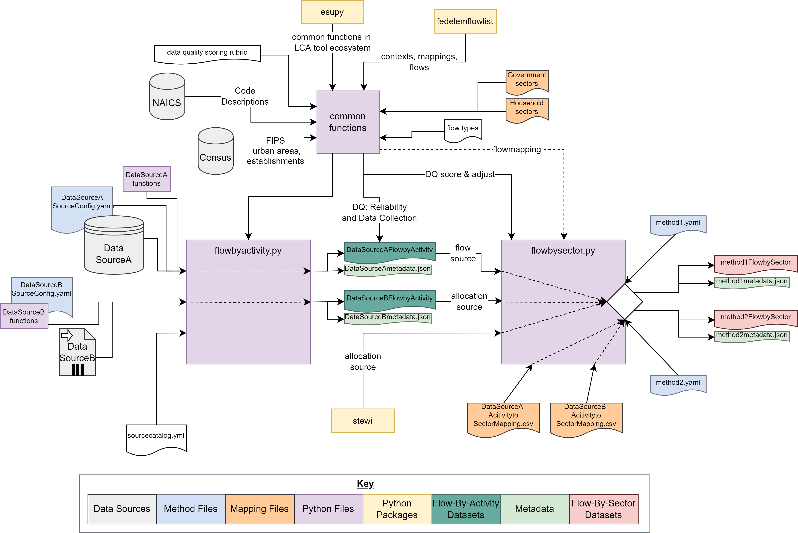

## Naming Schemas
The naming schemas chosen for an FBA are important. 

## USEPA Tools for Industrial Ecology
FLOWSA is one tool within the USEPA's [collection](https://www.epa.gov/land-research/tools-industrial-ecology-modeling-tiem) of open-source tools in the realm of industrial ecology. 
The FBS files generated within FLOWSA are used as inputs into USEEIO models 


# Generating Flow-By-Activity (FBA) Datasets
This section walks through the steps to generate an FBA. 
The steps are demonstrated by re-creating an existing FLOWSA 2017 FBA, [“USDA_CoA_Cropland”](https://github.com/USEPA/flowsa/blob/master/flowsa/methods/flowbyactivitymethods/USDA_CoA_Cropland.yaml), the 2017 US Department of Agriculture (USDA) Census of Agriculture (CoA) Cropland dataset.

## Overview of Steps to Generate a Flow-By-Activity Dataset
1. Create a YAML method file in the [methods/flowbyactivitymethods](https://github.com/USEPA/flowsa/tree/master/flowsa/methods/flowbyactivitymethods) directory, following the recommended [naming schema](#naming-schemas) and the steps for generating an [FBA yaml](#detailed-steps-to-writing-an-fba-method-yaml).
2. Determine where the data is accessed, for example the USDA_CoA_Cropland data is pulled from [USDA NASS Quick Stats](https://quickstats.nass.usda.gov/), but data can also be stored and accessed in the external data folder [data/external_data](https://github.com/USEPA/flowsa/tree/master/flowsa/data/external_data)
3. Create source-specific functions in a data source .py file, hosted in the [data_source_scripts](https://github.com/USEPA/flowsa/tree/master/flowsa/data_source_scripts) directory

## Detailed Steps to Writing an FBA method YAML
1. The first step is to write instructions for how to access the original source data. All FBA files are housed in the same directory [methods/flowbyactivitymethods](https://github.com/USEPA/flowsa/tree/master/flowsa/methods/flowbyactivitymethods). These instructions are written in a human-readable form (YAML files) and are later read in as a pandas dictionary in python. The YAML for USDA_CoA_Cropland can be found [here](https://github.com/USEPA/flowsa/blob/master/flowsa/methods/flowbyactivitymethods/USDA_CoA_Cropland.yaml), with an explanation of all possible parameters defined in any FBA method yaml found in the [flowbyactivitymethods/README](https://github.com/USEPA/flowsa/blob/master/flowsa/methods/flowbyactivitymethods/README.md).

2. The first lines of the YAML are used to generate bibliography information.

    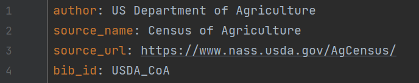

3. The next lines indicate if an API key is required and if so, the name of 
   the API key.

    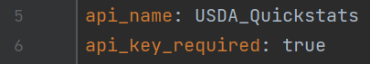

4. If an API key is required, a user must generate their own API key 
   ([instructions in the wiki](https://github.com/USEPA/flowsa/wiki/Using-FLOWSA#api-keys)) 
   and store the key in a .env file in a user’s
   [MODULEPATH](https://github.com/USEPA/flowsa/blob/master/flowsa/settings.py#L10).
   An example .env file is found in FLOWSA’s example folder,
   [here](https://github.com/USEPA/flowsa/blob/master/examples/API_Keys.env.example).

5. Most of the information in the YAML is used to build the URLs called to 
   import data and indicate what form the data is loaded as (json, csv, pdf,
   etc.). An option within the URLS is to surround a variable name in 
   double underscores to indicate that a string function will dynamically 
   replace the variable when the URLs are built, such as "__secLevel__." 

    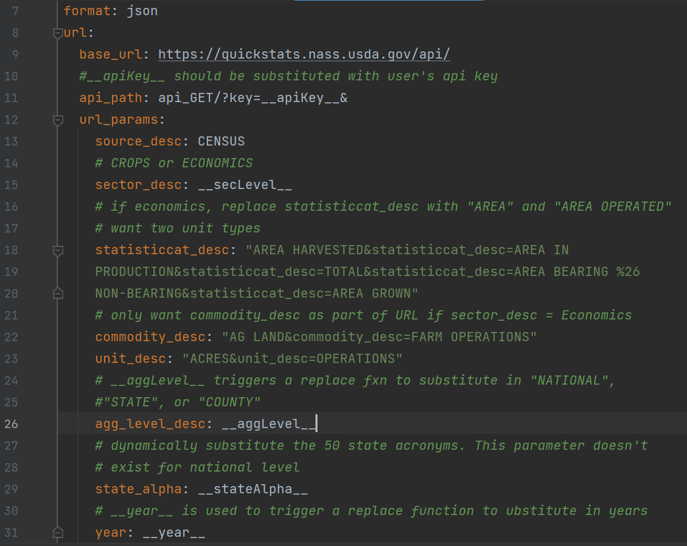

6. If there are any variables that need replacement in the URL build 
   ("__secLevel__"), the list of strings with which to replace the variable 
   are also listed in the YAML.

    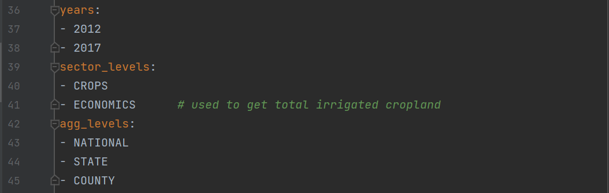

7. Although the functions to load, build, and parse Flow-By-Activity datasets are generalized, each FBA requires functions specific to the dataset. These functions are listed in the method yaml. We defined custom YAML tags to allow inheriting code from other yaml files. The primary tag found in FBA yamls is `!script_function:`, as included in the screenshot below. This tag directs the yaml to look for a file in the [data_source_scripts](https://github.com/USEPA/flowsa/tree/master/flowsa/data_source_scripts) directory, specifically at the file listed after `!script_function:`. In this case, we pull a function from [USDA_CoA_Cropland.py](https://github.com/USEPA/flowsa/blob/master/flowsa/data_source_scripts/USDA_CoA_Cropland.py). The final portion of the tag is which function to load for the FBA method. Here, when we want to call `url_replace_fxn`, we load the function `CoA_Cropland_URL_helper()` defined in [USDA_CoA_Cropland.py](https://github.com/USEPA/flowsa/blob/master/flowsa/data_source_scripts/USDA_CoA_Cropland.py).

    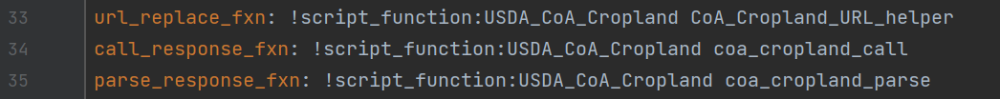


## Source-specific FBA column assignments
All FBA are formatted into specific [columns and column orders](https://github.com/USEPA/flowsa/blob/master/format%20specs/FlowByActivity.md). 
All FBA datasets contain these columns regardless if the columns contain non-null values. 
Many of these columns can be filled by filtering the original source data, while other column data are assigned by the FBA creater. 
- Columns filled using source terminology:
  - FlowAmount: Original source flow value
  - Unit: Original source units
  - ActivityProducedBy and ActivityConsumedBy: Original source activity name, using source terminology. Flows are assigned to "ActivityProducedBy" if the activity is producing the flow or "ActivityConsumedBy" if the activity consumes the flow. Values are assigned to both ActivityProducedBy and ActivityConsumedBy if there is information on how the flow moves between two activities. 
  - Location: If the data represent the US, the location column is assigned to Federal Infomration Processsing System (FIPS) codes for US, States, and Counties. If the data represent a country outside the US, the data are assigned to [ISO Country Codes](https://www.iso.org/iso-3166-country-codes.html) 
  - Year: If available within dataset
  - MeasureofSpread, Spread, DistributionType, Min, Max
  - Description
- Columns manually assigned:
  - Class: Suggested class assingments are defined in the [FLOWSA wiki](https://github.com/USEPA/flowsa/wiki/Available-Data#flow-classes)
  - SourceName: Source names should include the data author or publisher and the published data name or an acronym to represent the data contained in the dataset
  - FlowType: Assigned to "ELEMENTARY_FLOW", "TECHNOSPHERE_FLOW" or "WASTE_FLOW." Most data captured in FLOWSA are elementary flows as the data capture flows to or from the environment.
  - Compartment: Name of compartment to which release goes, e.g. "air", "water", "ground".
  - LocationSystem: Generally assigned as "FIPS_YEAR" where "YEAR" is replaced with [2010, 2013, or 2015](https://github.com/USEPA/flowsa/blob/master/flowsa/data/FIPS_Crosswalk.csv), as county codes have changed over the years. If the data represent a non-US country, LocationSystem is assigned to "ISO."
  - Year: Assign if not included in the dataset
  - DataReliability, DataCollection: Data scores are assigned using the [Data Quality Pedigree Matrix](https://github.com/USEPA/flowsa/blob/master/docs/DataQualityPedigreeMatrix.md).


## Steps to take before using Flow-By-Activity datasets
To use an FBA dataset within a Flow-By-Sector (FBS) method, 
1. Generate the FBA using the [FBA yaml method file](https://github.com/USEPA/flowsa/tree/master/flowsa/methods/flowbyactivitymethods)
2. Update the [source catalog](https://github.com/USEPA/flowsa/blob/master/flowsa/data/source_catalog.yaml)
3. Create an [activity-to-sector crosswalk](https://github.com/USEPA/flowsa/tree/master/flowsa/data/activitytosectormapping) as described [here](#mapping-fba-data-to-sectors-via-activity-to-sector-crosswalks.)
4. [Re-generate](https://github.com/USEPA/flowsa/blob/master/scripts/writeNAICScrosswalk.py) the master NAICS crosswalk, if the activity-to-sector crosswalk contains any new unoffical NAICS, as described [here](#re-running-sector-master-crosswalks).


## Mapping FBA data to sectors via Activity-to-Sector Crosswalks

Before Flow-By-Activity (FBA) datasets can be merged with other FBA or FBS data, the activity terminology must be standardized to create a column of data that FBAs can merge on. 
Data in FLOWSA are standardized by mapping activity names (original data source terminology) to industrial and final-use sectors, as described in the [_Sector_ definition section](#_sector_-definition). 
Standardizing activity names to sector names within FLOWSA requires a user-generated activity to sector mapping csv stored in the [data/activitytosectormapping](https://github.com/USEPA/flowsa/tree/master/flowsa/data/activitytosectormapping) directory. 
These mapping, or crosswalk, files can be created using activity to sector mapping files published by the data source, by contacting data publishers to ask for mappings, by looking at existing FLOWSA mapping files, and by using [NAICS definitions](https://www.census.gov/naics/). 
Activities should be assigned to the most accurate sector possible, ranging between 2- to 7- digit NAICS, if data are being attributed to NAICS.

### Re-Running Sector Master Crosswalks
There is a master sector crosswalk for each NAICS year available in FLOWSA, see [2012](https://github.com/USEPA/flowsa/blob/master/flowsa/data/NAICS_2012_Crosswalk.csv) and [2017](https://github.com/USEPA/flowsa/blob/master/flowsa/data/NAICS_2017_Crosswalk.csv). 
If a new user-generated activity to sector crosswalk includes any user-defined sectors (non-NAICS), the master crosswalk must be re-generated. 
If a new FBA crosswalk only includes sectors that already exist in FLOWSA, the master crosswalk does not need to be re-generated.
To re-generate the NAICS master crosswalks, run [flowsa/scripts/writeNAICScrosswalk.py](https://github.com/USEPA/flowsa/blob/master/scripts/writeNAICScrosswalk.py).


# Generating Flow-By-Sector Datasets

  - Mapping to fed elem flow list
    - Purpose of fed elem flow list
    - How to create flow list mapping in fed flow list package
  - Mapping to materials list
  - Harmonize FBAs before merging data
    - Geoscale, sectors, sector-year, units
  - Logistics of how an FBS is generated
    - All data first mapped to NAICS
  - Available attribution/allocation methods
    - List of available methods
    - Default attribution columns
      - How to use non-default
  - Available method yaml keys

Flow-By-Sector example: The main data source for creating a ["Water" Flow-By-Sector](https://github.com/USEPA/flowsa/blob/master/flowsa/methods/flowbysectormethods/Water_national_2015_m1.yaml) table is the [USGS](https://waterdata.usgs.gov/nwis), which publishes national water withdrawal information for nine broad categories. One of these categories is "Irrigation Crop", which can only be [mapped](https://github.com/USEPA/flowsa/blob/master/flowsa/data/activitytosectormapping/NAICS_Crosswalk_USGS_NWIS_WU.csv) to 3-digit NAICS ('111' and '112'). To reach the objective of mapping water withdrawal information to 6-digit NAICS, additional Flow-By-Activity datasets are called on for attribution purposes. In the case of "Irrigation Crop," acreage by crop type and water application rates (gal/acre) by crop type are multiplied to calculate water use by crop type at the 6-digit NAICS. A ratio is calculated for the quantity of water used by a crop out of the total water use calculated using the USDA datasets. This ratio is then multiplied by the USGS water withdrawal information for "Irrigation Crop," allocating the 3-digit NAICS to 6-digits.
      * Acreage information is published in the US Department of Agriculture (USDA) Census of Agriculture (CoA) and water application rates are published in the USDA Irrigation and Water Management Survey (IWMS).


To create an FBS, identify one or multiple primary FBAs that contain the primary data to be attributed to sectors. 
For example in the [Water_national_2015_m1](https://github.com/USEPA/flowsa/blob/master/flowsa/methods/flowbysectormethods/Water_national_2015_m1.yaml) methodology, there is one primary FBA identified to be attributed to sectors, [USGS_NWIS_WU](https://github.com/USEPA/flowsa/blob/master/flowsa/methods/flowbyactivitymethods/USGS_NWIS_WU.yaml).
This means that in the water method, we want to convert the water withdrawal data and terminology generated by [USGS](https://waterdata.usgs.gov/nwis/wu) to sectors. 
The USGS water withdrawal data fully represents water withdrawal within the US. 
On the other hand, in [Land_national_2012](https://github.com/USEPA/flowsa/blob/master/flowsa/methods/flowbysectormethods/Land_national_2012.yaml) there are four primary FBA datasets identified that contain information on how land is used in the US: EIA_CBECS_Land, EIA_MECS_Land, BLM_PLS, USDA_ERS_MLU.
To fully capture US land use, we need to pull data from four FBAs. 
Data within an FBA can be broken into groups or "activity sets," with each _activity set_ attributed to sectors using different methods and secondary data sources. 

## Generating Flow-By-Sector Models
Summary:
1. Create a Flow-By-Sector method yaml within the [methods/flowbysectormethods](https://github.com/USEPA/flowsa/tree/master/flowsa/methods/flowbysectormethods) directory
1. Identify targets for the FBS output
   - Target sector level for the FBS
   - Sector year (e.g, NAICS_2012_Code)
   - Geographic scale
1. Identify the primary FBA or FBS datasets required to generate an FBS
1. Mapping to [fed elem flow list](https://github.com/USEPA/fedelemflowlist)
1. Subset the primary data sources to only include the necessary data for the FBS method
1. Break the primary FBA/FBS datasets into "activity sets", grouped by _how_ the data will be attributed to sectors. Data within an FBA often requires multiple types of attribution. We can attribute data within a single FBS using different attribution methods, attribution sources. 
   - Optionally, can create an activity set csv file within [flowbysectoractivitysets](https://github.com/USEPA/flowsa/tree/master/flowsa/methods/flowbysectoractivitysets). These activity sets are generally created with method-specific scripts stored in [scripts/FlowBySector_Activity_Sets](https://github.com/USEPA/flowsa/tree/master/scripts/FlowBySector_Activity_Sets).
1. Identify additional FBA/FBS datasets required to attribute each "activity set" of the primary FBA to target sectors


## Behind-the-scenes steps in generating FBS
FLOWSA takes care of the behind-the-scenes logistics of attributing FBA data to sectors. 
These steps exist for all FBS methods, regardless of the type of data being attributed to sectors. 
1. Map all FBAs to sectors using crosswalks
1. Harmonize the FBAs by standardizing column information
   - Sectors
     - Converted to same sector year
   - [Units](https://github.com/USEPA/flowsa/blob/master/flowsa/data/unit_conversion.csv)
     - Converted to specific units identified within FLOWSA 
   - Location 
     - Standardize if datasets have disparate Locations (e.g., national-level vs state-level)
   - Geography levels (National, State, County)

### Harmonizing/Standardizing FBA Data


#### Sector Years
The BEA releases new sector codes in 5-year intervals. 
FLOWSA includes 2012 and 2017 codes. 
As codes change over time, it is important to note what year of data the sectors represent. 
If imported FBAs are sector-based, the sector year is defined as `activity_schema` in the [source_catalog](https://github.com/USEPA/flowsa/blob/master/flowsa/data/source_catalog.yaml). 
A single FBA can have different sector years based on the data source year. 

#### Sector Hierarchy 
Data can be "parent-completeChild", "parent-incompleteChild", or "flat."


### FBS Target Sectors
The target sectors can be flexible. 
An FBS can be output with any combination of sector lengths, but there cannot be any duplicate data. 
FBS datasets cannot contain data for both parent and child sectors. 
For example, an FBS cannot contain a row of data for _5622_ (Waste Treatment and Disposal) and _562212_ (Solid Waste Landfill). 

A straightforward example of target sector assignments can be found in [Land_national_2012](https://github.com/USEPA/flowsa/blob/master/flowsa/methods/flowbysectormethods/Land_national_2012.yaml), where all activity data are attributed to 6-digit sector codes. 

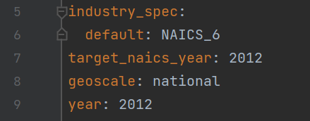

A slightly more complex target sector assignment exits for [REI_waste_national_2012](https://github.com/USEPA/flowsa/blob/master/flowsa/methods/flowbysectormethods/REI_waste_national_2012.yaml), where all activities are attributed to 6-digit sectors except for the waste management sectors '562212' and '562219', which are attributed to 7-digit sectors. 
These 7-digit waste management sectors are defined within FLOWSA to represent waste management sectors more specific than the offical NAICS management pathways. 

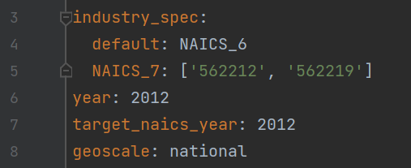

An example of a complex FBS target sector schema was created for [BEA_detail_target](https://github.com/USEPA/flowsa/blob/master/flowsa/methods/flowbysectormethods/BEA_detail_target.yaml) to create FBS with sectors that can best be mapped to detail-level BEA codes. 

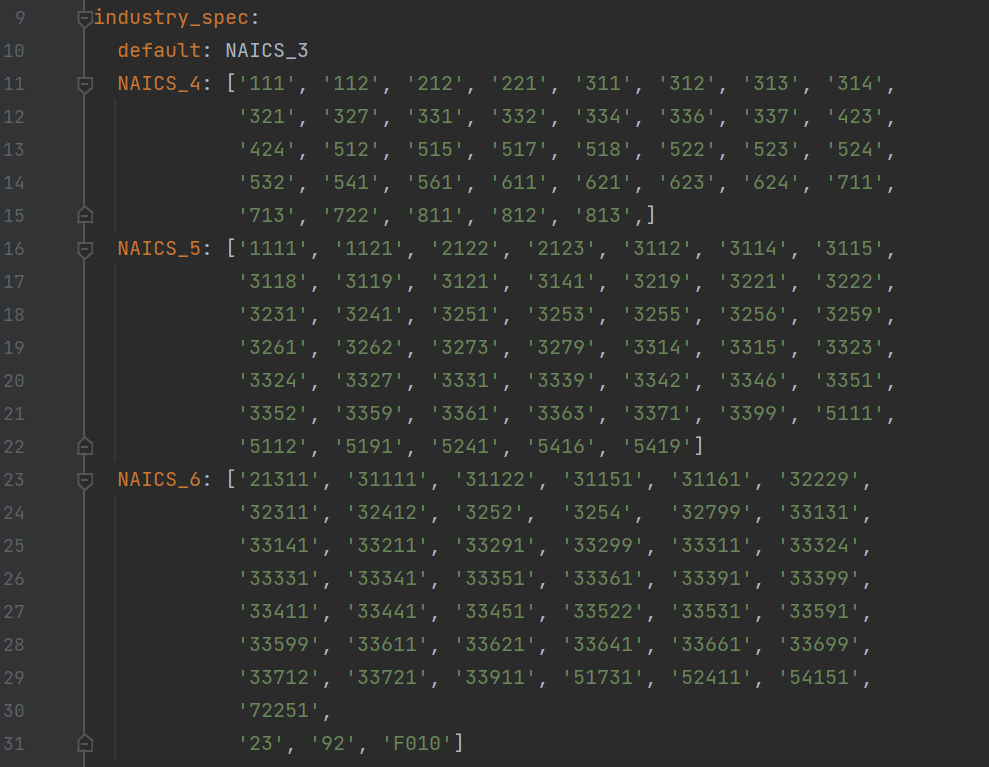

#### Activity Set Target Sectors
In addition to specifying the target output sector levels for the final FBS, it can be necessary to use further disaggregated sector levels for attributing activity sets within an FBS. 
For example, in the [Water m1 method](https://github.com/USEPA/flowsa/blob/master/flowsa/methods/flowbysectormethods/Water_common.yaml), the target output sector level is "NAICS_6", however, to best attribute livestock water withdrawal to NAICS_6, we want to first use several "NAICS_7" sectors to better represent the drinking rate of animals. 

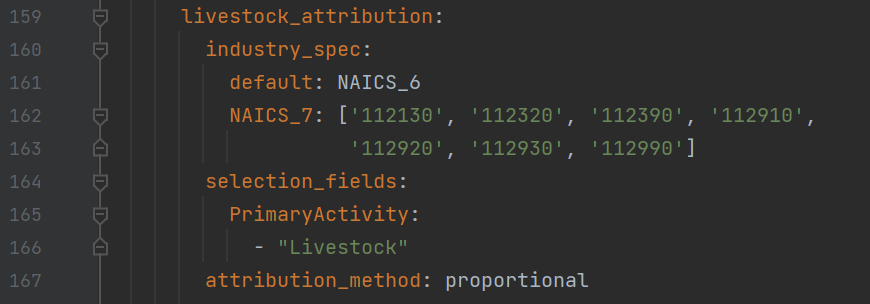


## Attributing on non-sector columns
See [REI_waste_national_2012](https://github.com/USEPA/flowsa/blob/master/flowsa/methods/flowbysectormethods/REI_waste_national_2012.yaml) for attribution on the "Flowable" column over sector columns

## Attribution methods
There are several methods of attribution available in FLOWSA to generate an FBS at the target sector level. 
To attribute a primary data source to target level sectors, identify the primary FBA data source and the attribution FBA data source. 

### Available Methods of Attribution
- direct: Activities are directly assigned to sectors using the source to
  NAICS crosswalk
- multiplication: Multiply the values in the primary source with
  values sharing the same sectors in the attribution source
- proportional: Activities are proportionally attributed to sectors using
  specified attribution data source
- equal: Equally attribute parent values to child values until reach target 
  sector length
- inheritance: Assign parent values to all child values. Usefull in 
  situations where value is a rate, such as kg/m2.

### Recursive vs Sequential Attribution
FLOWSA can attribute data recursively and sequentially.
Recursive attribution is a method of attributing primary FBA source data to sectors by looping through attribution methods to modify attribution data prior to modifying the primary FBA data. 

An example of recursive attribution is identified in the [Water FBS](https://github.com/USEPA/flowsa/blob/master/flowsa/methods/flowbysectormethods/Water_common.yaml) methodology. 

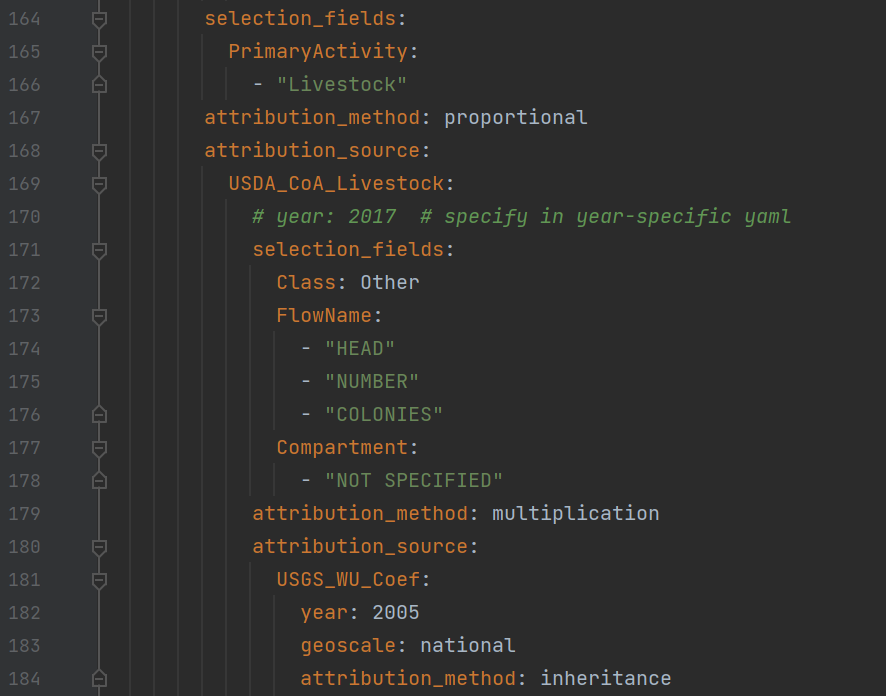

Sequential attribution is a method of attributing primary FBA source data to sectors by first applying an attribution method with an attribution FBA. Then, after applying the attribution method, applying additional attribution methods with more FBA datasets. 
An example of sequential attribution can be found in the [Land_state_2012](https://github.com/USEPA/flowsa/blob/master/flowsa/methods/flowbysectormethods/Land_state_2012.yaml) FBS method.


FBS method attribution can be applied with combinations of recursive and sequential attribution methods. 

## Caching data sources

## Additional options when generating FBS
FBS can be generated to include the orignal data source terminology activity columns and the sector names. 

```
import flowsa.flowbysector
import pandas as pd

fbsmethod = 'Water_national_2015_m1'

fbs = pd.DataFrame(flowsa.flowbysector.FlowBySector.generateFlowBySector(
    fbsmethod,
    download_sources_ok=True,
    retain_activity_columns=True,
    append_sector_names=True
))
```
  

# Accessing FLOWSA-Generated Data and Data Storage
Data generated via FLOWSA are stored in a user's local directory. 
To check where the files are stored, run the following code in the python console:
```
import appdirs
appdirs.user_data_dir()
```
Any data downloaded from [Data Commons](https://dmap-data-commons-ord.s3.amazonaws.com/index.html?prefix=flowsa/) should also be saved in a user's local directory.

Users can access the most recent datasets output from FLOWSA via EPA's Amazon s3 [storage service](https://dmap-data-commons-ord.s3.amazonaws.com/index.html?prefix=flowsa/).

# Data Visualization

# FLOWSA Git/GitHub Management

## Branches
We generally follow the flow outlined by Vincent Driessen
https://nvie.com/posts/a-successful-git-branching-model/

Branches can be arbritrarily created for specific reasons. 
We attempt to have more branches with fewer changes on them rather that one branch with many changes.

## New Release Workflow
1.  Create a release branch (e.g., "v2.0.0-release")
1.  Increase package version in release branch (if not already done)
1.	Remove `@develop` from usepa python packages in setup and requirements
1.	Create pull request to master (GitHub Action tests will run)
1.	Merge into master
1.	If desired, release package
1.	Merge back into release branch and add `@develop` back into setup/requirements
1.  Merge release branch back into master, delete release branch

## GitHub Actions
Part of our quality assurance is through the use of auto generated tests in GitHub Actions each time we issue a pull request. 


