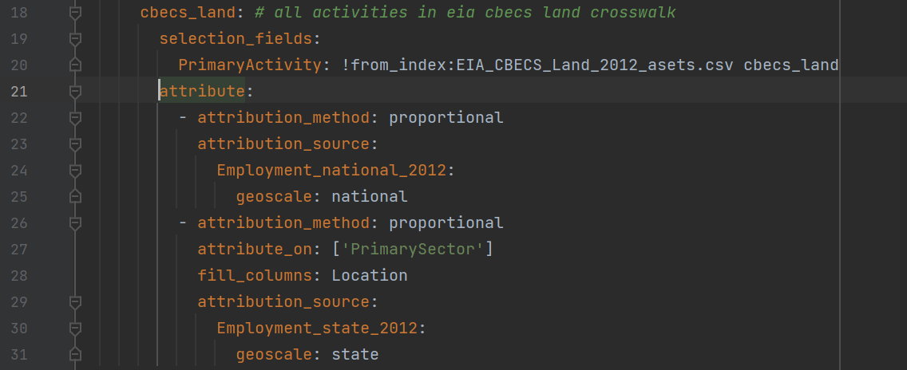

FLOWSA v2.0.1: A FLOWSA User-Guide

# Table of Contents
- Summary
  - Package Objective
  - Define Flow-By-Activity (FBA) and Flow-By-Sector (FBS)
  
- Creating an FBA
  - Identifying Data Sources
    - Types of source data (url, excel, etc.)
  - Assigning appropriate Classes
    - Available Classes
  - Assigning to Activity-Produced-By or Activity-Consumed-By
- Creating an activity-to-sector mapping file

- Activity to sector mapping
  - Look for activity to sector mapping published by the source
  - Contact data publishers to ask for mapping
  - Look at existing mappings for other data sources
  - Use NAICS definitions
    
- Creating an FBS
  - Mapping to fed elem flow list
    - Purpose of fed elem flow list
    - How to create flow list mapping in fed flow list package
  - Mapping to materials list
  - Logistics of how an FBS is generated
    - All data first mapped to NAICS
  - Available attribution/allocation methods
    - List of available methods
    - Default attribution columns
      - How to use non-default
  - Available method yaml keys

- Data Documentation
  - Git hash/versions
  
- Data Visualization
  - Available data vis functions

- Package Managment in Git/GitHub
  - Steps for new package release
  - Purpose of using branches
  - Forking FLOWSA

# FLOWSA Objective Summary
FLOWSA is a Python package designed to streamline attributing environmental, economic, emissions, waste, material, and other data to economic sectors. 
Data can be attributed to sectors that produce the data and/or sectors that consume the data. In this way, the direct flows of data between economic sectors can be captured. 
All data are output in standardized table formats. 

For example, we can capture the movement of water from public supply withdrawals (SectorProducedBy) to domestic use (SectorConsumedBy). 
Resource data are generally attributed to 2-6 digit North American Industry Classification System ([NAICS](https://www.census.gov/naics/)) Codes. 
The economic sector data has been extended to include unofficial 7-digit sector codes when the official 6-digit codes are not detailed enough. 
These codes can be aggregated to official NAICS codes. 
FLOWSA also allows users to append material codes to allow material tracking. 
   - See the [Census of Agriculture activity to sector mapping file](https://github.com/USEPA/flowsa/blob/master/flowsa/data/activitytosectormapping/NAICS_Crosswalk_USDA_CoA_Cropland.csv) for example 7-digit sector codes for crops orthe [Wasted Food Report](https://github.com/USEPA/flowsa/blob/master/flowsa/data/activitytosectormapping/NAICS_Crosswalk_EPA_WFR.csv) for example waste-management 7-digit codes.
   - See the [FLOWSA FBS datasets](https://github.com/USEPA/HIO/blob/main/flowsa/flowbysectormethods/Waste_national_2018.yaml) developed in the USEPA Hybrid Input-Output (HIO) GitHub repository for example [material](https://github.com/USEPA/HIO/blob/main/data/Materials.csv) flow tracking. 

FLOWSA is one tool within the USEPA's [collection](https://www.epa.gov/land-research/tools-industrial-ecology-modeling-tiem) of open-source tools in the realm of industrial ecology.

Users can access the most recent datasets output from FLOWSA via EPA's Amazon s3 [storage service](https://dmap-data-commons-ord.s3.amazonaws.com/index.html?prefix=flowsa/).

# FLOWSA Data Outputs
FLOWSA generates two types of data sets:

1. Import environmental (and other types of) data from publicly available 
   datasets, formatting the data into a standardized table, a [Flow-By-Activity](https://github.com/USEPA/flowsa/blob/master/format%20specs/FlowByActivity.md) dataset. Flow-By-Activity datasets are largely unchanged from the original data source, with the exception of formatting. Data that are currently available in the Flow-By-Activity format are listed [here](https://github.com/USEPA/flowsa/wiki/Available-Data#flow-by-activity-datasets). See [Creating a Flow-By-Activity Dataset](https://github.com/USEPA/flowsa/wiki/Contributing#creating-a-flow-by-activity-dataset) for details on methodology.

1. Attribute resource use, waste, emissions, and loss to economic sectors, generally 2-6 digit NAICS Codes, formatting the data into a standardized [Flow-By-Sector](https://github.com/USEPA/flowsa/blob/master/format%20specs/FlowBySector.md) table. These new datasets are generally created using multiple Flow-By-Activity datasets. A list of available Flow-By-Sector datasets can be found [here](https://github.com/USEPA/flowsa/wiki/Available-Data#flow-by-sector-datasets), with a more detailed explanation of methodology found in [Creating a Flow-By-Sector Dataset](https://github.com/USEPA/flowsa/wiki/Contributing#creating-a-flow-by-sector-dataset).

    * Flow-By-Sector example: The main data source for creating a ["Water" Flow-By-Sector](https://github.com/USEPA/flowsa/blob/master/flowsa/methods/flowbysectormethods/Water_national_2015_m1.yaml) table is the [USGS](https://waterdata.usgs.gov/nwis), which publishes national water withdrawal information for nine broad categories. One of these categories is "Irrigation Crop", which can only be [mapped](https://github.com/USEPA/flowsa/blob/master/flowsa/data/activitytosectormapping/NAICS_Crosswalk_USGS_NWIS_WU.csv) to 3-digit NAICS ('111' and '112'). To reach the objective of mapping water withdrawal information to 6-digit NAICS, additional Flow-By-Activity datasets arecalled on for allocation purposes. In the case of "Irrigation Crop," acreage by crop type and water application rates (gal/acre) by crop type are multiplied to calculate water use by crop type at the 6-digit NAICS. A ratio is calculated for the quantity of water used by a crop out of the total water use calculated using the USDA datasets. This ratio is then multiplied by the USGS water withdrawal information for "Irrigation Crop," allocating the 3-digit NAICS to 6-digits.
      * Acreage information is published in the US Department of Agriculture (USDA) Census of Agriculture (CoA) and water application rates are published in the USDA Irrigation and Water Management Survey (IWMS).

## Documentation Outputs
In addition to the parquet datasets output by FLOWSA, we also capture:
1. Log Files
2. Metadata files: Captures the git hash and versions of each primary and attribution FBA dataset used. Provides links to the code within the FLOWSA GitHub repository at the time the datasets were generated. 
      

# Step-By-Step Guide to Generating a Flow-By-Activity Dataset

Flow-By-Activity (FBA) datasets are environmental and other data formatted into a [standardized table](https://github.com/USEPA/flowsa/blob/master/format%20specs/FlowByActivity.md). 
The data are standardized to enable use for Flow-By-Sector (FBS) table generation. 
The defining columns for an FBA dataset are the "ActivityProducedBy" and "ActivityConsumedBy" columns. 
These columns contain information on the "activity" that either produces or consumes 
The FBA tables can include optional columns, but all FBAs must contain a number of the same columns. 
One such optional column is "Suppressed" which can be used to indicate which rows contain suppressed data and then used in source-sepecific functions to estimate suppressed data.

This example demonstrates creating the 2017 US Department of Agriculture (USDA) Census of Agriculture (CoA) Cropland FBA. 
The name for the FBA is “USDA_CoA_Cropland_2017.”

A summary of how to generate an FBS is as follows.
1. Create a new YAML method file
2. Determine where the data is accessed 
3. Create source-sepecific functions in a data source .py file

Steps to writing an FBA method YAML:
1. The first step is to write instructions for how to access the original source data. All FBA files are housed in the same directory [methods/flowbyactivitymethods](https://github.com/USEPA/flowsa/tree/master/flowsa/methods/flowbyactivitymethods). These instructions are written in a human-readable form (YAML files) and are later read in as a pandas dictionary in python. The YAML for USGS_NWIS_WU can be found [here](https://github.com/USEPA/flowsa/blob/master/flowsa/methods/flowbyactivitymethods/USDA_CoA_Cropland.yaml), with an explanation of possible parameters found in the [README](https://github.com/USEPA/flowsa/blob/master/flowsa/methods/flowbyactivitymethods/README.md).

2. The first lines of the YAML are used to generate bibliography information.

    {#fig:fba_bib}

3. The next lines indicate if an API key is required and if so, the name of 
   the API key.

   {#fig:fba_api_key}

4. If an API key is required, a user must generate their own API key 
   ([instructions in the wiki](https://github.com/USEPA/flowsa/wiki/Using-FLOWSA#api-keys)) 
   and store the key in a .env file in a user’s
   [MODULEPATH](https://github.com/USEPA/flowsa/blob/master/flowsa/settings.py#L10).
   An example .env file is found in FLOWSA’s example folder,
   [here](https://github.com/USEPA/flowsa/blob/master/examples/API_Keys.env.example).

5. Most of the information in the YAML is used to build the URLs called to 
   import data and indicate what form the data is loaded as (json, csv, pdf,
   etc.). An option within the URLS is to surround a variable name in 
   double underscores to indicate that a string function will dynamically 
   replace the variable when the URLs are built, such as "__secLevel__." 

    {#fig:fba_url}

6. If there are any variables that need replacement in the URL build 
   ("__secLevel__), the list of strings with which to replace the variable 
   are also listed in the YAML.
    
{#fig:fba_url_replace}

7. Although the functions to load, build, and parse Flow-By-Activity 
   datasets are generalized, each FBA requires functions specific to the 
   dataset. These functions are listed in the method yaml.
    
{#fig:fba_source_fxns}


## Source-specific FBA column assignments
All FBA are formatted into specific [columns and column orders](https://github.com/USEPA/flowsa/blob/master/format%20specs/FlowByActivity.md). 
All FBA datasets contain these columns regardless if the columns contain non-null values. 
Many of these columns can be filled by filtering the original source data, while other column data are assigned by the FBA creater. 
- Columns filled using source terminology:
  - FlowAmount: Original source flow value
  - Unit: Original source units
  - ActivityProducedBy and ActivityConsumedBy: Original source activity name, using source terminology. Flows are assigned to "ActivityProducedBy" if the activity is producing the flow or "ActivityConsumedBy" if the activity consumes the flow. Values are assigned to both ActivityProducedBy and ActivityConsumedBy if there is information on how the flow moves between two activities. 
  - Location: If the data represent the US, the location column is assigned to Federal Infomration Processsing System (FIPS) codes for US, States, and Counties. If the data represent a country outside the US, the data are assigned to [ISO Country Codes](https://www.iso.org/iso-3166-country-codes.html) 
  - Year: If available within dataset
  - MeasureofSpread, Spread, DistributionType, Min, Max
  - Description
- Columns manually assigned:
  - Class: Suggested class assingments are defined in the [FLOWSA wiki](https://github.com/USEPA/flowsa/wiki/Available-Data#flow-classes)
  - SourceName: Source names should include the data author or publisher and the published data name or an acronym to represent the data contained in the dataset
  - FlowType: Assigned to "ELEMENTARY_FLOW", "TECHNOSPHERE_FLOW" or "WASTE_FLOW." Most data captured in FLOWSA are elementary flows as the data capture flows to or from the environment.
  - Compartment: Name of compartment to which release goes, e.g. "air", "water", "ground".
  - LocationSystem: Generally assigned as "FIPS_YEAR" where "YEAR" is replaced with [2010, 2013, or 2015](https://github.com/USEPA/flowsa/blob/master/flowsa/data/FIPS_Crosswalk.csv), as county codes have changed over the years. If the data represent a non-US country, LocationSystem is assigned to "ISO."
  - Year: Assign if not included in the dataset
  - DataReliability, DataCollection: Data scores are assigned using the [Data Quality Pedigree Matrix](https://github.com/USEPA/flowsa/blob/master/docs/DataQualityPedigreeMatrix.md).


## Activity-to-Sector Crosswalks

Before Flow-By-Activity (FBA) datasets can be merged, the data in each FBA must be standardized. 
Data in FLOWSA are standardized by attributing all activity names (original data source terminology) to industrial and final-use sectors, generally North American Industry Classification System (NAICS) codes. 
NAICS are a series of 2- to 6- digit codes that capture US economic activities, maintained by the [U.S. Census Bureau](https://www.census.gov/naics/). 
Activities in each FBA are assigned to the most accurate NAICS possible, using information provided by the data source when available. 
This means that an activity name can be assigned to any 2- to 6-digit NAICS. 
We make these assignments in csv files stored in the [data/activitytosectormapping](https://github.com/USEPA/flowsa/tree/master/flowsa/data/activitytosectormapping) directory. 
At times, the activity cannot be accurately represented by an official NAICS code. 
When the FBA data are more specific than a 6-digit NAICS, we create unoffical 7-digit NAICS, which sum to the official NAICS-6. 
For example, there are many NAICS-7 defined in [NAICS_CrosswalkUSDA_CoA_Cropland.csv](https://github.com/USEPA/flowsa/blob/master/flowsa/data/activitytosectormapping/NAICS_Crosswalk_USDA_CoA_Cropland.csv). 
Because NAICS generally represent the U.S. business economy, we capture data in FLOWSA that cannot be directly assigned to a NAICS code because the NAICS code does not exist. 
There are no NAICS for household and government activities. 
For these situations, we create non-NAICS to represent the activites, generally using Bureau of Economic Analysis (BEA) codes when applicable. 
Mappings for household and government codes are defined in the [data/](https://github.com/USEPA/flowsa/tree/master/flowsa/data) directory within [Household_SectorCodes](https://github.com/USEPA/flowsa/blob/master/flowsa/data/Household_SectorCodes.csv) and [Government_SectorCodes](https://github.com/USEPA/flowsa/blob/master/flowsa/data/Government_SectorCodes.csv), respectively.

### Sector Years
The BEA releases new sector codes in 5-year intervals. 
FLOWSA includes 2012 and 2017 codes. 
As codes change over time, it is important to note what year of data the sectors represent. 
If imported FBAs are sector-based, the sector year is defined as `activity_schema` in the [source_catalog](https://github.com/USEPA/flowsa/blob/master/flowsa/data/source_catalog.yaml). 
A single FBA can have different sector years based on the data source year. 

### Sector Hierarchy 
Data can be "parent-completeChild", "parent-incompleteChild", or "flat."

### Re-Running NAICS Master Crosswalks
There is a master sector crosswalk for each NAICS year available in FLOWSA. 
The master crosswalk needs to be re-generated anytime new, unoffical NAICS are added to an activity-to-sector crosswalk. 
If no unoffical NAICS are used in a new crosswalk, the master crosswalk does not need regeneration.
To re-generate the NAICS master crosswalks, run [flowsa/scripts/writeNAICScrosswalk.py](https://github.com/USEPA/flowsa/blob/master/scripts/writeNAICScrosswalk.py).


# Using Flow-By-Activity Datasets
To use an FBA dataset within a Flow-By-Sector (FBS) method, 
1. Generate the FBA using the [FBA yaml method file](https://github.com/USEPA/flowsa/tree/master/flowsa/methods/flowbyactivitymethods)
2. Update the [source catalog](https://github.com/USEPA/flowsa/blob/master/flowsa/data/source_catalog.yaml)
3. Create an [activity-to-sector crosswalk](https://github.com/USEPA/flowsa/tree/master/flowsa/data/activitytosectormapping)
4. [Re-generate](https://github.com/USEPA/flowsa/blob/master/scripts/writeNAICScrosswalk.py) the master NAICS crosswalk, if the activity-to-sector crosswalk contains any new unoffical NAICS. 


# Step-By-Step Guide to Generating a Flow-By-Sector (FBS) Dataset

1. Create a Flow-By-Sector method yaml within the [methods/flowbysectormethods](https://github.com/USEPA/flowsa/tree/master/flowsa/methods/flowbysectormethods) directory
2. Create an activity set csv file within [flowbysectoractivitysets](https://github.com/USEPA/flowsa/tree/master/flowsa/methods/flowbysectoractivitysets). These activity sets are generally created with method-specific scripts stored in [scripts/FlowBySector_Activity_Sets](https://github.com/USEPA/flowsa/tree/master/scripts/FlowBySector_Activity_Sets).
3. Identify target sector levels. 
4. Identify the primary FBA or FBS source data to attribute to target sector levels
5. Subset the primary data sources to only include the necessary data for the FBS method
4. Identify the primary FBA and FBS activity sets
5. Identify the FBA and FBS datasets required to attribute the primary data activity sets to target sector levels
6. Mapping to [fed elem flow list](https://github.com/USEPA/fedelemflowlist)
7. Break the primary FBA and/or FBS into activity sets dependent on how one wants to attribute data. Data within an FBA often requires multiple types of attribution. We can attribute data within a single FBS using different attribution methods, attribution sources. 


Flow-By-Sector datasets are standardized tables generated by attributing Flow-By-Activity data to sectors. 
The FBS tables contain standard columns as defined in [format specs/FlowBySector.md](https://github.com/USEPA/flowsa/blob/master/format%20specs/FlowBySector.md). 
FBS datasets can be created from a single FBA or from as many FBAs as are necessary. 
To create an FBS, identify one or mulitple primary FBAs that contain the primary data to be attributed to sectors. 
For example in the [Water_national_2015_m1](https://github.com/USEPA/flowsa/blob/master/flowsa/methods/flowbysectormethods/Water_national_2015_m1.yaml) methodology, there is one primary FBA identified to be attributed to sectors, [USGS_NWIS_WU](https://github.com/USEPA/flowsa/blob/master/flowsa/methods/flowbyactivitymethods/USGS_NWIS_WU.yaml).
This means that in the water method, we want to convert the water withdrawal data and terminology generated by [USGS](https://waterdata.usgs.gov/nwis/wu) to sectors. 
The USGS water withdrawal data fully represents water withdrawal within the US. 
On the other hand, in [Land_national_2012](https://github.com/USEPA/flowsa/blob/master/flowsa/methods/flowbysectormethods/Land_national_2012.yaml) there are four primary FBA datasets identified that contain information on how land is used in the US: EIA_CBECS_Land, EIA_MECS_Land, BLM_PLS, USDA_ERS_MLU.
To fully capture US land use, we need to pull data from four FBAs. 

## Standardizing FBAs prior to attribution
Before merging FBA and FBS data for attribution, data are automatically standardized:
1. Sectors
   2. Converted to same sector year
2. [Units](https://github.com/USEPA/flowsa/blob/master/flowsa/data/unit_conversion.csv)
   3. Converted to specific units identified within FLOWSA
3. Location
   4. Standardize if datasets have disparate Locations (e.g., national-level vs state-level)

## Target sectors
The target sectors can be flexible. 
An FBS can be output with any combination of sector lengths, but there cannot be any duplicate data. 
FBS datasets cannot contain data for both parent and child sectors. 
For example, an FBS cannot contain a row of data for _5622_ (Waste Treatment and Disposal) and _562212_ (Solid Waste Landfill). 

A straightforward example of target sector assignments can be found in [Land_national_2012](https://github.com/USEPA/flowsa/blob/master/flowsa/methods/flowbysectormethods/Land_national_2012.yaml), where all activity data are attributed to 6-digit sector codes. 


A slightly more complex target sector assignment exits for [REI_waste_national_2012](https://github.com/USEPA/flowsa/blob/master/flowsa/methods/flowbysectormethods/REI_waste_national_2012.yaml), where all activities are attributed to 6-digit sectors except for the waste management sectors '562212' and '562219', which are attributed to 7-digit sectors. 
These 7-digit waste management sectors are defined within FLOWSA to represent waste management sectors more specific than the offical NAICS management pathways.


An example of a complex FBS target sector schema was created for [BEA_detail_target](https://github.com/USEPA/flowsa/blob/master/flowsa/methods/flowbysectormethods/BEA_detail_target.yaml) to create FBS with sectors that can best be mapped to detail-level BEA codes. 


### Activity Set Target Sectors
In addition to specifying the target output sector levels for the final FBS, it can be necessary to use further disaggregated sector levels for attributing activity sets within an FBS. 
For example, in the [Water m1 method](https://github.com/USEPA/flowsa/blob/master/flowsa/methods/flowbysectormethods/Water_common.yaml), the target output sector level is "NAICS_6", however, to best attribute livestock water withdrawal to NAICS_6, we want to first use several "NAICS_7" sectors to better represent the drinking rate of animals. 


## Attributing on non-sector columns
See [REI_waste_national_2012](https://github.com/USEPA/flowsa/blob/master/flowsa/methods/flowbysectormethods/REI_waste_national_2012.yaml) for attribution on the "Flowable" column over sector columns

## Attribution methods
There are several methods of attribution available in FLOWSA to generate an FBS at the target sector level. 
To attribute a primary data source to target level sectors, identify the primary FBA data source and the attribution FBA data source. 

### Available Methods of Attribution
- direct: Activities are directly assigned to sectors using the source to
  NAICS crosswalk
- multiplication: Multiply the values in the primary source with
  values sharing the same sectors in the attribution source
- proportional: Activities are proportionally attributed to sectors using
  specified attribution data source
- equal: Equally attribute parent values to child values until reach target 
  sector length
- inheritance: Assign parent values to all child values. Usefull in 
  situations where value is a rate, such as kg/m2.

### Recursive vs Sequential Attribution
FLOWSA can attribute data recursively and sequentially.
Recursive attribution is a method of attributing primary FBA source data to sectors by looping through attribution methods to modify attribution data prior to modifying the primary FBA data. 

An example of recursive attribution is identified in the [Water FBS](https://github.com/USEPA/flowsa/blob/master/flowsa/methods/flowbysectormethods/Water_common.yaml) methodology. 


Sequential attribution is a method of attributing primary FBA source data to sectors by first applying an attribution method with an attribution FBA. Then, after applying the attribution method, applying additional attribution methods with more FBA datasets. 
An example of sequential attribution can be found in the [Land_state_2012](https://github.com/USEPA/flowsa/blob/master/flowsa/methods/flowbysectormethods/Land_state_2012.yaml) FBS method. 



FBS method attribution can be applied with combinations of recursive and sequential attribution methods. 

## Caching data sources

## Additional options when generating FBS
FBS can be generated to include the orignal data source terminology activity columns and the sector names. 

```
import flowsa.flowbysector
import pandas as pd

fbsmethod = 'Water_national_2015_m1'

fbs = pd.DataFrame(flowsa.flowbysector.FlowBySector.generateFlowBySector(
    fbsmethod,
    download_sources_ok=True,
    retain_activity_columns=True,
    append_sector_names=True
))
```
  

# Data Documentation
We take steps to document the datasets we generate at each release of FLOWSA by appending git versions and hashes to each FLOWSA dataset output.

# Additional Notes
## Naming Schemas
The naming schemas chosen for an FBA are important. 


# Git/GitHub Management

## Branches
We generally follow the flow outlined by Vincent Driessen
https://nvie.com/posts/a-successful-git-branching-model/

Branches can be arbritrarily created for specific reasons. 
We attempt to have more branches with fewer changes on them rather that one branch with many changes.

## Workflow for new release
1.  Create a release branch (e.g., "v2.0.0-release")
1.  Increase package version in release branch (if not already done)
1.	Remove `@develop` from usepa python packages in setup and requirements
1.	Create pull request to master (GitHub Action tests will run)
1.	Merge into master
1.	If desired, release package
1.	Merge back into release branch and add `@develop` back into setup/requirements
1.  Merge release branch back into master, delete release branch

## GitHub Actions
Part of our quality assurance is through the use of auto generated tests in GitHub Actions each time we issue a pull request. 


